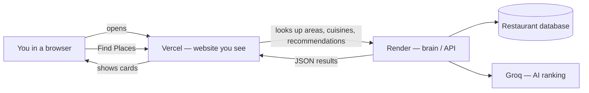

# Restaurant Recommendation App

AI-powered restaurant recommendations for Bangalore, inspired by Zomato. Users pick location, budget, cuisine, and a free-text “vibe”; the app filters ~12k real restaurants and uses Groq (LLM) to rank and explain the best matches.

**Live app (share this link):**  
https://restaurant-recommendation-app-seven.vercel.app

---

## How it works (simple overview)

Think of the system as three cloud services working together:



| Piece | What it does | URL |
|--------|----------------|-----|
| **Vercel** | The pretty website (React UI) | [restaurant-recommendation-app-seven.vercel.app](https://restaurant-recommendation-app-seven.vercel.app) |
| **Render** | The **backend API** — search, filters, LLM calls | [restaurant-recommendation-api-8pgm.onrender.com](https://restaurant-recommendation-api-8pgm.onrender.com) |
| **Streamlit Cloud** | Optional **admin dashboard** only (status, config) | [restaurant-recommendation-app-2deployrecommendation.streamlit.app](https://restaurant-recommendation-app-2deployrecommendation.streamlit.app) |

**Important:** The public app you share is on **Vercel**. The **backend is on Render**, not Streamlit. Vercel forwards `/api/*` requests to Render automatically.

---

## Why Streamlit doesn’t show the main UI

This project has **two different frontends**:

1. **React app on Vercel** — custom Zomato-style design (filters, cards, “Describe your vibe”). This is the **real product UI**.
2. **Streamlit page** — a small **operator dashboard** (restaurant count, DB status, LLM on/off, API docs). It was never meant to replace the redesigned frontend.

**Streamlit is built for quick data apps in Python**, not pixel-perfect marketing layouts. When the UI was redesigned (Tailwind, hero, search card, recommendation cards), that work went into **`frontend/` (React)** and deploys to **Vercel**.

Streamlit stayed in the repo as:
- A deployment option we tried early on for hosting the API
- A simple status page for developers

We moved the **API to Render** because Streamlit Cloud couldn’t reliably expose REST endpoints for the Vercel app. Streamlit now only hosts the optional admin view.

If the Streamlit page looks blank, reboot the app on [share.streamlit.io](https://share.streamlit.io) after pulling the latest `main` — a fix ensures the dashboard reloads correctly on each visit.

---

## Architecture (technical)

```
frontend/          React + Vite + Tailwind → Vercel
src/               Python FastAPI, filters, LLM orchestration → Render
streamlit_app.py   Admin dashboard only → Streamlit Cloud
data/processed/    SQLite database (Bangalore restaurants)
```

**Request flow**

1. Browser loads the React app from Vercel.
2. User submits preferences → browser calls `/api/v1/recommendations` on the **same Vercel domain**.
3. Vercel **proxies** that request to Render (`restaurant-recommendation-api-8pgm.onrender.com`).
4. Render loads candidates from SQLite, calls Groq when enabled, returns ranked JSON.
5. React renders recommendation cards.

---

## Local development

**Prerequisites:** Python 3.11+, Node 18+, [Groq API key](https://console.groq.com/)

```bash
# Backend API
pip install -r requirements-dev.txt
cp .env.example .env          # add GROQ_API_KEY
uvicorn src.phase2.main:app --reload --port 8000

# Frontend (separate terminal)
cd frontend
npm install
npm run dev                   # http://localhost:5173 — proxies /api to :8000

# Optional: Streamlit admin dashboard
streamlit run streamlit_app.py
```

Run ingestion if the database is missing:

```bash
python scripts/ingest.py
```

Tests:

```bash
pytest
```

---

## Deployment

| Service | Trigger | Config |
|---------|---------|--------|
| **Vercel** | Push to `main` (`frontend/`) | `frontend/vercel.json` proxies `/api/*` to Render |
| **Render** | Push to `main` | `render.yaml` — start: `uvicorn render_app:app` |
| **Streamlit** | Push to `main` | Main file: `streamlit_app.py`, secrets in Cloud dashboard |

**Render secrets:** `GROQ_API_KEY`, optional overrides for `DATABASE_URL`, `CORS_ORIGINS`.

**Streamlit secrets:** same keys if you use the admin dashboard; not required for the Vercel app.

**Note:** Render free tier **sleeps when idle** — the first request after a while may take 30–60 seconds.

---

## API (Render)

| Method | Path | Description |
|--------|------|-------------|
| GET | `/api/v1/health` | Health + restaurant count |
| GET | `/api/v1/meta/cities` | Supported cities |
| GET | `/api/v1/meta/areas?city=Bangalore` | Areas |
| GET | `/api/v1/meta/cuisines?city=Bangalore` | Cuisines |
| POST | `/api/v1/recommendations` | Get recommendations |

Interactive docs: `https://restaurant-recommendation-api-8pgm.onrender.com/docs`

---

## Repository layout

```
frontend/           React UI (Vercel)
src/phase2/         FastAPI routes and app factory
src/phase3/         LLM integration (Groq)
src/phase4/         Ranking engine
src/deploy/         Cloud env + database bootstrap
streamlit_app.py    Streamlit admin entry
render_app.py       Render entry
render.yaml         Render blueprint
data/processed/     restaurants.db
docs/               Architecture and design notes
```

---

## License & data

Restaurant data derived from the [Zomato Hugging Face dataset](https://huggingface.co/datasets/ManikaSaini/zomato-restaurant-recommendation). LLM inference via [Groq](https://groq.com/).
