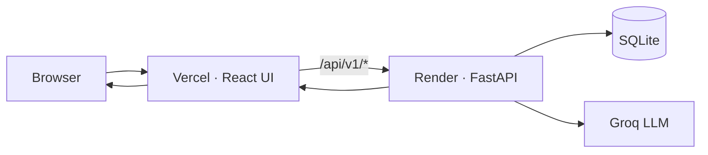

# Restaurant Recommendation App

A full-stack, AI-powered restaurant discovery app for Bangalore — inspired by Zomato’s “Discover” experience. I built this end to end: data pipeline, FastAPI backend, Groq-powered ranking, and a custom React frontend deployed to production.

**[Live demo →](https://restaurant-recommendation-app-seven.vercel.app)**

---

## What it does

- Filter **12,000+ Bangalore restaurants** by area, budget, cuisine, and minimum rating  
- Describe your mood in plain English (“cozy date night with pasta…”)  
- Get **AI-ranked recommendations** with short explanations for each place  
- Browse results in a responsive, Zomato-inspired UI  

---

## Features

| Area | Highlights |
|------|------------|
| **Data** | Hugging Face Zomato dataset → cleaned SQLite store |
| **Backend** | FastAPI REST API, rule-based pre-filtering, Groq LLM ranking |
| **Frontend** | React 18, Vite, TypeScript, Tailwind CSS |
| **Ops** | 94 automated tests, Streamlit admin dashboard, cloud deployment |

---

## Tech stack

**Frontend** — React, Vite, TypeScript, Tailwind CSS · hosted on **Vercel**

**Backend** — Python, FastAPI, SQLAlchemy, SQLite · hosted on **Render**

**AI** — Groq (`llama-3.3-70b-versatile`)

**Tooling** — pytest, Streamlit (internal dashboard)

---

## Architecture



The public site runs on Vercel. API calls go to the same domain and are proxied to Render, where filtering and LLM inference happen. Streamlit Cloud hosts a separate **admin dashboard** (health metrics, config) — not the user-facing app.

| Component | URL |
|-----------|-----|
| Web app | https://restaurant-recommendation-app-seven.vercel.app |
| API | https://restaurant-recommendation-api-8pgm.onrender.com |
| API docs | https://restaurant-recommendation-api-8pgm.onrender.com/docs |
| Admin dashboard | https://restaurant-recommendation-app-2deployrecommendation.streamlit.app |

---

## Project structure

```
frontend/              React UI
src/phase1/            Data ingestion & database
src/phase2/            FastAPI routes & validation
src/phase3/            LLM integration (Groq)
src/phase4/            Ranking engine
src/deploy/            Cloud runtime & secrets bootstrap
render_app.py          Render entry point
streamlit_app.py       Streamlit admin entry
data/processed/        restaurants.db
docs/                  Architecture & design notes
```

Detailed design: [`docs/architecture.md`](docs/architecture.md)

---

## Run locally

**Requirements:** Python 3.11+, Node 18+, [Groq API key](https://console.groq.com/)

```bash
git clone https://github.com/sakurasasuke9211-dev/restaurant-recommendation-app.git
cd restaurant-recommendation-app

# Backend
pip install -r requirements-dev.txt
cp .env.example .env        # add GROQ_API_KEY
uvicorn src.phase2.main:app --reload --port 8000

# Frontend (new terminal)
cd frontend && npm install && npm run dev
# → http://localhost:5173
```

If `data/processed/restaurants.db` is missing:

```bash
python scripts/ingest.py
```

Run tests:

```bash
pytest
```

---

## API overview

| Method | Path | Description |
|--------|------|-------------|
| `GET` | `/api/v1/health` | Service health |
| `GET` | `/api/v1/meta/cities` | Supported cities |
| `GET` | `/api/v1/meta/areas` | Areas for a city |
| `GET` | `/api/v1/meta/cuisines` | Cuisines for a city |
| `POST` | `/api/v1/recommendations` | Get recommendations |

Example request body:

```json
{
  "location": "Bangalore",
  "area": "Indiranagar",
  "max_budget": 800,
  "cuisine": "Italian",
  "min_rating": 4.0,
  "additional_preferences": "Quiet spot for a date night"
}
```

---

## Deployment

I deploy from the `main` branch:

- **Vercel** — `frontend/` (see `frontend/vercel.json` for API proxy to Render)  
- **Render** — `render.yaml` → `uvicorn render_app:app`  
- **Streamlit Cloud** — `streamlit_app.py` + secrets in the dashboard  

Production secrets (`GROQ_API_KEY`, `CORS_ORIGINS`) live in the cloud provider dashboards, not in this repo.

---

## Acknowledgments

- Restaurant data: [ManikaSaini/zomato-restaurant-recommendation](https://huggingface.co/datasets/ManikaSaini/zomato-restaurant-recommendation) (Hugging Face)  
- LLM inference: [Groq](https://groq.com/)

---

## Author

**Soumya Bara** · [GitHub @sakurasasuke9211-dev](https://github.com/sakurasasuke9211-dev)

Personal portfolio project — built and deployed independently.
