# Architecture: AI-Powered Restaurant Recommendation System

> **Source:** [problemStatement](./problemStatement)  
> **Version:** 1.4  
> **Last updated:** June 2026  
> **Planned changes:** [improvements.md](./improvements.md)

---

## Table of Contents

1. [Executive Summary](#1-executive-summary)
2. [Goals & Non-Goals](#2-goals--non-goals)
3. [System Context](#3-system-context)
4. [High-Level Architecture](#4-high-level-architecture)
5. [Technology Stack](#5-technology-stack)
6. [Phase 1 — Data Ingestion & Storage](#6-phase-1--data-ingestion--storage)
7. [Phase 2 — User Input & API Layer](#7-phase-2--user-input--api-layer)
8. [Phase 3 — Integration Layer](#8-phase-3--integration-layer)
9. [Phase 4 — Recommendation Engine (LLM)](#9-phase-4--recommendation-engine-llm)
10. [Phase 5 — Output Display (Frontend)](#10-phase-5--output-display-frontend)
11. [Phase 6 — Hardening & Production](#11-phase-6--hardening--production)
12. [Data Models](#12-data-models)
13. [API Specification](#13-api-specification)
14. [Prompt Engineering Strategy](#14-prompt-engineering-strategy)
15. [Error Handling & Fallbacks](#15-error-handling--fallbacks)
16. [Security Considerations](#16-security-considerations)
17. [Testing Strategy](#17-testing-strategy)
18. [Deployment Architecture](#18-deployment-architecture)
19. [Project Structure](#19-project-structure)
20. [Phase Dependencies & Timeline](#20-phase-dependencies--timeline)
21. [Future Enhancements](#21-future-enhancements)
22. [Implementation Status](#22-implementation-status)

---

## 1. Executive Summary

This document defines the end-to-end architecture for an **AI-powered restaurant recommendation service** inspired by Zomato. The system accepts structured user preferences (location, budget, cuisine, rating, and free-text extras), filters a real-world restaurant dataset, and uses a Large Language Model (LLM) to rank candidates and generate human-like explanations.

The build is organized into **six phases**, each producing a testable increment:

| Phase | Name | Primary Output | Status |
|-------|------|----------------|--------|
| 1 | Data Ingestion & Storage | Clean, queryable restaurant database | **Done** |
| 2 | User Input & API Layer | Validated preference intake via REST API | **Done** |
| 3 | Integration Layer | Filter pipeline, Groq LLM prompt + ranking | **Done** |
| 4 | Recommendation Engine | Ranked results with AI explanations | **Done** |
| 5 | Output Display | Zomato AI Discover web application | **Done (v1.3 UI refresh)** |
| 6 | Hardening & Production | Reliability, observability, deployment | Planned |

Phases 1–5 are implemented and testable end-to-end via the React UI (`frontend/`) and REST API. See [§22 Implementation Status](#22-implementation-status) and [improvements.md](./improvements.md) for known gaps and next changes.

---

## 2. Goals & Non-Goals

### Goals

- Load and preprocess the [Zomato restaurant dataset](https://huggingface.co/datasets/ManikaSaini/zomato-restaurant-recommendation) from Hugging Face.
- Accept user preferences: location, budget tier, cuisine, minimum rating, and additional free-text preferences.
- Filter restaurant data deterministically before invoking the LLM (cost control + relevance).
- Use an LLM to rank restaurants, explain each recommendation, and optionally summarize choices.
- Display results with: restaurant name, cuisine, rating, estimated cost, and AI-generated explanation.

### Non-Goals (v1)

- User authentication and persistent user profiles.
- Real-time restaurant availability or live Zomato API integration.
- Payment, booking, or order placement.
- Mobile native apps (web-first).
- Training a custom ML ranking model (LLM + rule-based fallback is sufficient for v1).

---

## 3. System Context

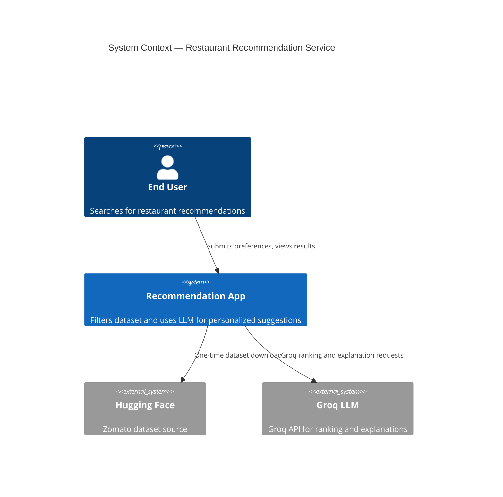

### External Dependencies

| Dependency | Purpose | Interaction Pattern |
|------------|---------|---------------------|
| Hugging Face `datasets` | Source dataset | One-time / scheduled ETL |
| **Groq LLM API** | Ranking + explanations | Per-request, synchronous; API key loaded from `.env` |
| SQLite / PostgreSQL | Restaurant persistence | Read-heavy after ingestion |

---

## 4. High-Level Architecture

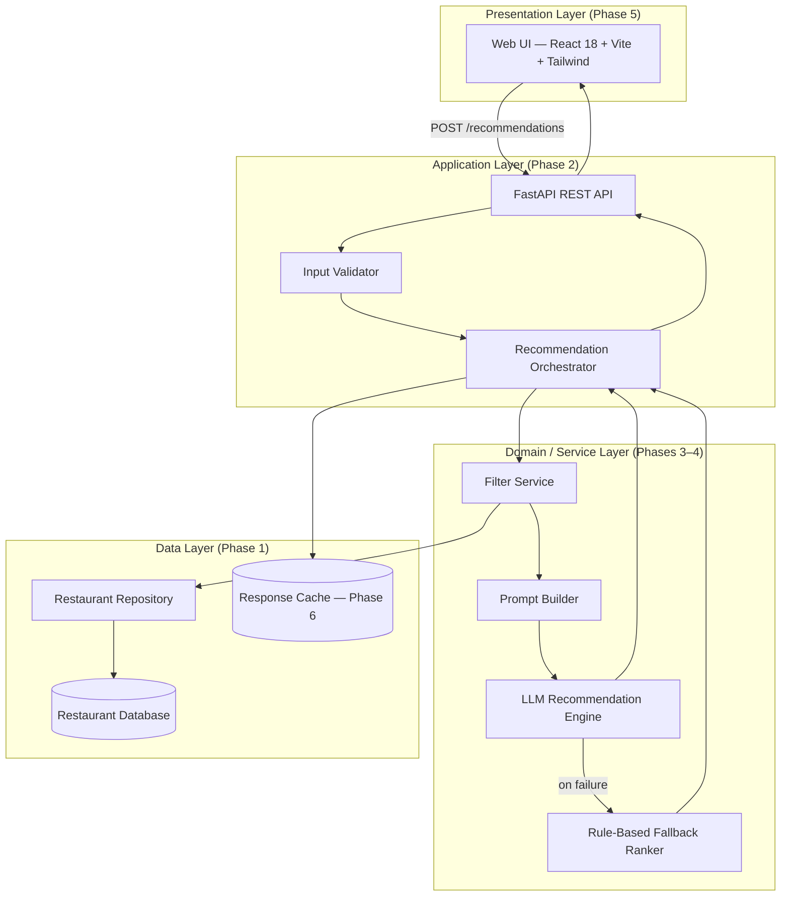

### Request Lifecycle (End-to-End)

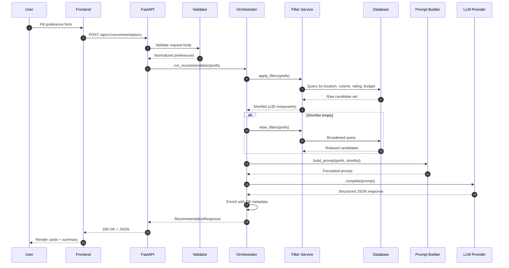

---

## 5. Technology Stack

| Layer | Technology | Rationale |
|-------|------------|-----------|
| **Language** | Python 3.11+ | Strong data/ML ecosystem, FastAPI support |
| **API Framework** | FastAPI | Async, automatic OpenAPI docs, Pydantic integration |
| **Validation** | Pydantic v2 | Type-safe request/response models |
| **Dataset Loading** | `datasets`, `pandas` | Native Hugging Face integration |
| **Database (MVP)** | SQLite + SQLAlchemy | Zero-config local development |
| **Database (Prod)** | PostgreSQL + SQLAlchemy | Scalable reads, indexing |
| **LLM Client** | **Groq API** via `groq` Python SDK | Fast inference, OpenAI-compatible chat API, structured JSON output |
| **Frontend** | React 18 + Vite + TypeScript | Client-side SPA in `frontend/`; dev server on `:5173` |
| **Styling** | Tailwind CSS 3 + design tokens | Zomato AI Discover layout from `design/zomato-ai-home-mockup.png` |
| **Framework choice** | React + Vite (frontend) | UI is a client-side SPA; production host: **Vercel** |
| **Backend host (prod)** | **Streamlit Community Cloud** | Python service hosting the recommendation API / pipeline |
| **HTTP Client** | `fetch` | Native; Vite proxies `/api` → `:8000` |
| **Testing** | `pytest`, `httpx` (async test client) | Backend unit + integration tests |
| **Linting** | `ruff`, `mypy` (optional) | Code quality |
| **Containerization** | Docker + docker-compose | Reproducible environments |
| **Secrets** | `.env` file (project root) | `GROQ_API_KEY` and other config; never committed to git |

---

## 6. Phase 1 — Data Ingestion & Storage

### 6.1 Objective

Transform the raw Hugging Face Zomato dataset into a clean, indexed, queryable datastore that supports efficient filtering by location, cuisine, rating, and budget.

### 6.2 Component Diagram

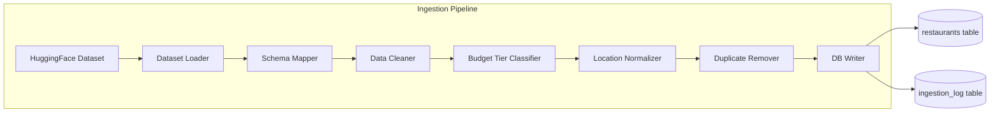

### 6.3 Ingestion Steps

#### Step 1: Load Dataset

```python
# Conceptual flow — scripts/ingest.py
from datasets import load_dataset

dataset = load_dataset(
    "ManikaSaini/zomato-restaurant-recommendation",
    split="train"  # verify available splits during implementation
)
```

#### Step 2: Extract Relevant Fields

Map raw columns to the canonical schema. Expected source fields (names may vary — inspect dataset on first load):

| Source Field (approx.) | Target Field | Transformation |
|------------------------|--------------|----------------|
| `name` | `name` | Strip whitespace, title-case |
| `location` / `city` / `listed_in(city)` | `city` | Normalize to canonical city names |
| `location` / `address` | `area`, `address` | Parse area from location string |
| `cuisines` | `cuisines` | Split comma-separated → JSON array |
| `approx_cost(for two people)` | `cost_for_two` | Parse numeric; handle ranges ("300-400" → 350) |
| `rate` | `rating` | Parse float; handle "NEW", "-", null → NULL |
| `votes` | `votes` | Integer |
| `rest_type` | `restaurant_type` | String |
| `online_order` | `online_order` | Yes/No → boolean |
| `book_table` | `book_table` | Yes/No → boolean |
| `dish_liked` | `popular_dishes` | Comma-separated → array |

#### Step 3: Data Cleaning Rules

| Issue | Rule |
|-------|------|
| Missing rating | Set `rating = NULL`; exclude from min-rating filter or treat as unrated |
| Rating string "4.1/5" | Extract numeric portion |
| Cost range "500-800" | Use midpoint (650) |
| Cost symbols ("₹1,200") | Strip currency symbols and commas |
| Duplicate restaurants | Deduplicate on `(name, city, address)` |
| Empty cuisine | Set `cuisines = ["Unknown"]` or exclude |
| Invalid city | Log and skip, or map via alias table |

#### Step 4: Budget Tier Classification

Derive `price_range` enum from `cost_for_two` using percentile bands **per city** (recommended) or global thresholds:

| Tier | Global Threshold (INR, for two) | Description |
|------|----------------------------------|-------------|
| `low` | ≤ 400 | Budget-friendly |
| `medium` | 401 – 800 | Mid-range |
| `high` | > 800 | Premium |

> **Note:** Per-city percentiles (33rd / 66th) produce more accurate tiers across cities with different cost-of-living.

#### Step 5: Location Normalization

Maintain a `city_aliases` mapping:

```json
{
  "Bengaluru": "Bangalore",
  "Bangalore": "Bangalore",
  "New Delhi": "Delhi",
  "Delhi NCR": "Delhi",
  "Gurgaon": "Gurgaon",
  "Gurugram": "Gurgaon"
}
```

#### Step 6: Database Persistence

- Write cleaned records to `restaurants` table.
- Create indexes on: `city`, `rating`, `price_range`, and a full-text or JSON index on `cuisines`.
- Log ingestion metadata: record count, timestamp, errors.

### 6.4 Database Schema (Phase 1)

```sql
CREATE TABLE restaurants (
    id              INTEGER PRIMARY KEY AUTOINCREMENT,
    name            TEXT NOT NULL,
    city            TEXT NOT NULL,
    area            TEXT,
    address         TEXT,
    cuisines        TEXT NOT NULL,       -- JSON array: ["Italian", "Pizza"]
    cost_for_two    INTEGER,             -- INR
    price_range     TEXT NOT NULL,       -- 'low' | 'medium' | 'high'
    rating          REAL,                -- 0.0 – 5.0
    votes           INTEGER DEFAULT 0,
    restaurant_type TEXT,
    online_order    BOOLEAN DEFAULT FALSE,
    book_table      BOOLEAN DEFAULT FALSE,
    popular_dishes  TEXT,                -- JSON array
    created_at      TIMESTAMP DEFAULT CURRENT_TIMESTAMP
);

CREATE INDEX idx_restaurants_city ON restaurants(city);
CREATE INDEX idx_restaurants_rating ON restaurants(rating);
CREATE INDEX idx_restaurants_price_range ON restaurants(price_range);
CREATE INDEX idx_restaurants_city_rating ON restaurants(city, rating);
```

### 6.5 Phase 1 Deliverables & Exit Criteria

| Deliverable | Exit Criterion | Actual |
|-------------|----------------|--------|
| `scripts/ingest.py` | Successfully loads full dataset | **12,494** restaurants ingested |
| `src/phase1/schema.py` | SQLAlchemy models defined | Done |
| `src/phase1/loader.py` | Reusable query functions | Done |
| `data/processed/restaurants.db` | Populated SQLite database | Done |
| Ingestion report | Logs count, null rates, cities covered | **Bangalore only** (dataset limitation) |

> **Dataset note:** The Hugging Face split currently yields a single city (`Bangalore`). The `area` column is populated for ~99.9% of rows (neighborhoods such as Whitefield, HSR, BTM). Multi-city support is code-ready via `city` + alias normalization; see [improvements.md](./improvements.md).

**Validation queries to pass:**

```sql
-- At least 5 cities with > 100 restaurants each
SELECT city, COUNT(*) FROM restaurants GROUP BY city ORDER BY COUNT(*) DESC;

-- Budget distribution is non-empty per tier
SELECT price_range, COUNT(*) FROM restaurants GROUP BY price_range;

-- Rating filter works
SELECT COUNT(*) FROM restaurants WHERE city = 'Bangalore' AND rating >= 4.0;
```

---

## 7. Phase 2 — User Input & API Layer

### 7.1 Objective

Expose a stable REST API that accepts user preferences, validates them, and hands off a normalized `UserPreferences` object to the recommendation orchestrator.

### 7.2 Component Diagram

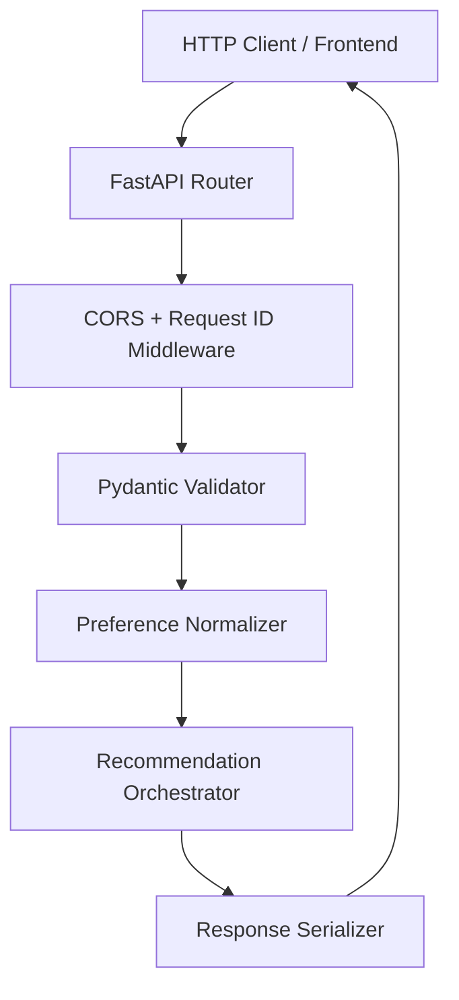

### 7.3 Preference Input Model

```python
# backend/api/schemas.py (conceptual)

class BudgetTier(str, Enum):
    LOW = "low"
    MEDIUM = "medium"
    HIGH = "high"

class UserPreferences(BaseModel):
    location: str = Field(..., min_length=2, max_length=100)
    budget: BudgetTier
    cuisine: str = Field(..., min_length=2, max_length=50)
    min_rating: float = Field(..., ge=0.0, le=5.0)
    additional_preferences: str | None = Field(None, max_length=500)

    @field_validator("location", "cuisine")
    @classmethod
    def strip_and_title(cls, v: str) -> str:
        return v.strip()
```

### 7.4 Validation Rules

| Field | Validation | Normalization |
|-------|------------|---------------|
| `location` | Required; must match known city or alias | Apply `city_aliases` map |
| `budget` | Enum: `low`, `medium`, `high` | None |
| `cuisine` | Required string | Case-insensitive; trim |
| `min_rating` | Float 0.0–5.0 | Round to 1 decimal |
| `additional_preferences` | Optional; max 500 chars | Trim; reject HTML/script tags |

### 7.5 API Endpoints (Phase 2)

| Method | Path | Description |
|--------|------|-------------|
| `GET` | `/api/v1/health` | Health check |
| `GET` | `/api/v1/meta/cities` | List supported cities |
| `GET` | `/api/v1/meta/cuisines` | List available cuisines (optionally filtered by city) |
| `POST` | `/api/v1/recommendations` | Main recommendation endpoint |

### 7.6 Middleware & Cross-Cutting Concerns

- **CORS:** Allow frontend origin in development (`http://localhost:5173`).
- **Request ID:** Attach `X-Request-ID` header for log correlation.
- **Rate limiting (Phase 6):** Throttle `/recommendations` to prevent LLM abuse.
- **OpenAPI docs:** Auto-generated at `/docs` via FastAPI.

### 7.7 Phase 2 Deliverables & Exit Criteria

| Deliverable | Exit Criterion | Actual |
|-------------|----------------|--------|
| `src/phase2/main.py` | App starts on port 8000 | Done |
| `src/phase2/api/routes.py` | All endpoints respond | Done |
| `src/phase2/api/schemas.py` | Pydantic models with validation | Done |
| OpenAPI spec | Accessible at `/docs` | Done |
| Invalid input | Returns 422 with field-level errors | Done |

---

## 8. Phase 3 — Integration Layer

### 8.1 Objective

Bridge raw user preferences and the **Groq LLM** by (1) deterministically filtering the database to a manageable shortlist, (2) constructing a structured prompt for Groq, and (3) invoking Groq to rank restaurants and generate explanations.

### 8.2 Filter Pipeline Architecture

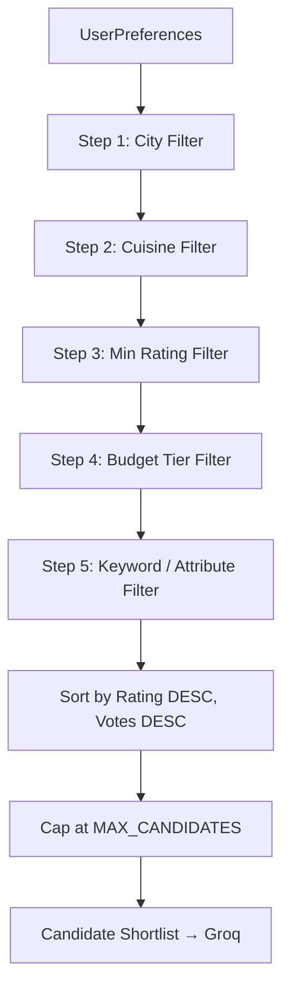

> **Config (`src/config.py`):** `MAX_CANDIDATES` (default 30) caps rows sent to Groq. `MAX_RECOMMENDATIONS` (default 5) caps API output. Planned change: fixed `LLM_CANDIDATE_COUNT` in code — see [improvements.md §3.1](./improvements.md#31-fixed-llm-candidate-count-p0).

### 8.3 Filter Implementation Details

#### Filter 1: City

```sql
SELECT * FROM restaurants WHERE city = :normalized_city
```

#### Filter 2: Cuisine (case-insensitive contains)

```sql
-- cuisines stored as JSON array; query approach depends on DB
-- SQLite example:
SELECT * FROM restaurants
WHERE city = :city
  AND cuisines LIKE '%' || :cuisine || '%'
```

#### Filter 3: Minimum Rating

```sql
AND (rating IS NOT NULL AND rating >= :min_rating)
```

#### Filter 4: Maximum Budget (for two)

```sql
AND (cost_for_two IS NOT NULL AND cost_for_two <= :max_budget)
```

The API compares the user's numeric **`max_budget`** (INR for two people) against `cost_for_two`. The filter service sets **`budget_blocked: true`** when this query returns zero rows but the same cuisine/area/rating filters would match at least one restaurant with no budget cap — signaling the UI to show the budget-specific empty message.

#### Filter 5: Additional Preferences (keyword extraction)

Parse free-text into keyword tokens and match against `restaurant_type`, `popular_dishes`, and boolean flags:

| User Keyword | Match Target |
|--------------|--------------|
| "family friendly" | `restaurant_type` ILIKE '%Casual Dining%' OR '%Family%' |
| "quick service" | `restaurant_type` ILIKE '%Quick Bites%' OR '%Fast Food%' |
| "online order" | `online_order = TRUE` |
| "book table" | `book_table = TRUE` |
| dish name (e.g. "biryani") | `popular_dishes` contains keyword |

Scoring: restaurants matching more keywords rank higher within the shortlist (pre-LLM signal).

### 8.4 Relaxation Strategy (Empty Shortlist)

When zero candidates remain, relax filters in order (track which were relaxed for transparency):

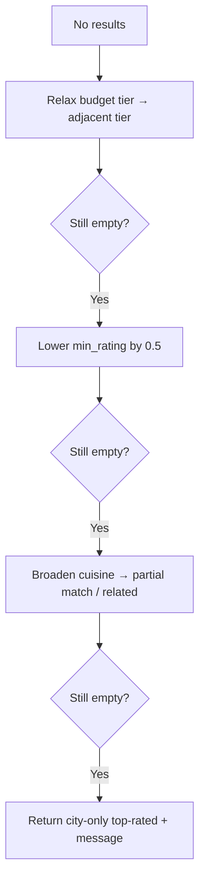

Return `meta.filters_relaxed: true` in the API response so the UI can inform the user.

### 8.5 Prompt Builder

The prompt builder assembles two blocks: **system instructions** and **user context**.

```python
# src/phase3/prompt.py (conceptual)

def build_prompt(prefs: UserPreferences, candidates: list[Restaurant]) -> list[dict]:
    system = SYSTEM_PROMPT_TEMPLATE
    user = USER_PROMPT_TEMPLATE.format(
        location=prefs.location,
        budget=prefs.budget.value,
        cuisine=prefs.cuisine,
        min_rating=prefs.min_rating,
        additional=prefs.additional_preferences or "None",
        candidates=json.dumps([c.to_llm_dict() for c in candidates], indent=2),
        max_results=5,
    )
    return [
        {"role": "system", "content": system},
        {"role": "user", "content": user},
    ]
```

Each `c.to_llm_dict()` includes only fields the LLM needs (keeps token count low):

```json
{
  "id": 42,
  "name": "Truffles",
  "cuisines": ["American", "Italian"],
  "rating": 4.6,
  "cost_for_two": 900,
  "price_range": "high",
  "restaurant_type": "Casual Dining",
  "popular_dishes": ["Burger", "Pasta"],
  "online_order": true
}
```

### 8.6 Groq LLM Integration

Phase 3 uses **Groq** as the LLM provider for ranking and explanation generation. The Groq API key is stored in the project root `.env` file and loaded at runtime via environment variables — it must never be hardcoded or committed to version control.

#### Configuration (`.env`)

```env
# Groq LLM (Phase 3)
GROQ_API_KEY=gsk_your_key_here
LLM_PROVIDER=groq
LLM_MODEL=llama-3.3-70b-versatile
LLM_ENABLED=true
LLM_TIMEOUT_SECONDS=30
```

| Variable | Required | Description |
|----------|----------|-------------|
| `GROQ_API_KEY` | Yes | Groq API key from [console.groq.com](https://console.groq.com); set in `.env` only |
| `LLM_PROVIDER` | No | Defaults to `groq` |
| `LLM_MODEL` | No | Groq model ID (e.g. `llama-3.3-70b-versatile`, `mixtral-8x7b-32768`) |
| `LLM_ENABLED` | No | Set `false` to use rule-based fallback without calling Groq |
| `LLM_TIMEOUT_SECONDS` | No | Request timeout; default `30` |

Copy `.env.example` to `.env` and fill in your `GROQ_API_KEY` before running the recommendation pipeline.

#### Groq Client (Phase 3)

```python
# src/phase3/llm.py (conceptual)
import os
from groq import Groq

client = Groq(api_key=os.getenv("GROQ_API_KEY"))

def complete(messages: list[dict]) -> str:
    response = client.chat.completions.create(
        model=os.getenv("LLM_MODEL", "llama-3.3-70b-versatile"),
        messages=messages,
        temperature=0.3,
        max_tokens=1500,
        response_format={"type": "json_object"},
    )
    return response.choices[0].message.content
```

#### Groq Client Settings

| Parameter | Recommended Value | Notes |
|-----------|-------------------|-------|
| Provider | **Groq** | Phase 3 LLM provider |
| Model | `llama-3.3-70b-versatile` | Good balance of speed and quality on Groq |
| Temperature | 0.3 | Low creativity for consistent ranking |
| Max tokens | 1500 | Sufficient for 5 recommendations + summary |
| Timeout | 30 seconds | Fail fast to fallback ranker |
| Retries | 2 with exponential backoff | Handle transient Groq API errors |
| Response format | JSON object mode | Reduces parsing failures |

#### Phase 3 LLM Flow

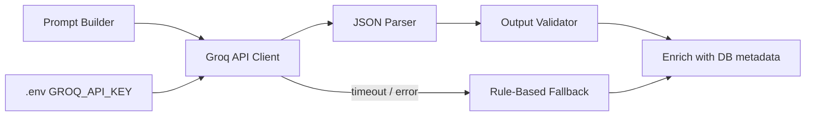

### 8.7 Phase 3 Deliverables & Exit Criteria

| Deliverable | Exit Criterion | Actual |
|-------------|----------------|--------|
| `src/phase3/filter.py` | All 5 filters implemented | Done |
| `src/phase3/prompt.py` | Prompt templates with variable injection | Done |
| `src/phase3/llm.py` | Groq client; reads `GROQ_API_KEY` from `.env` | Done |
| Relaxation logic | Returns results for edge-case queries | Done |
| Unit tests | Filter combinations produce expected counts | Done |
| Groq integration test | Mocked + optional live call returns ranked JSON | Done |
| Token estimate | Shortlist ≤ 30 keeps prompt under ~4K tokens | Done |

---

## 9. Phase 4 — Recommendation Engine (LLM)

### 9.1 Objective

Extend the Phase 3 Groq integration: parse the structured Groq response, validate it against the candidate set, enrich results with full database metadata, and wire the full pipeline through the orchestrator with a rule-based fallback when Groq is unavailable.

### 9.2 Engine Architecture

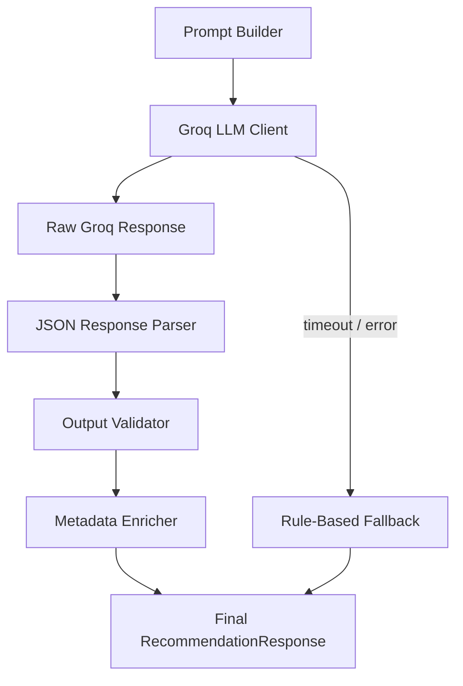

### 9.3 Groq Client Configuration

> **Note:** The Groq client is implemented in Phase 3 (`src/phase3/llm.py`). Phase 4 adds validation, enrichment, and fallback logic on top of it.

| Parameter | Recommended Value | Notes |
|-----------|-------------------|-------|
| Provider | **Groq** | Configured via `GROQ_API_KEY` in `.env` |
| Model | `llama-3.3-70b-versatile` | Cost-effective, fast on Groq infrastructure |
| Temperature | 0.3 | Low creativity for consistent ranking |
| Max tokens | 1500 | Sufficient for 5 recommendations + summary |
| Timeout | 30 seconds | Fail fast to fallback |
| Retries | 2 with exponential backoff | Handle transient API errors |
| Response format | JSON mode / structured output | Reduces parsing failures |

### 9.4 Expected LLM Output Schema

```json
{
  "summary": "Based on your preference for Italian cuisine in Bangalore with a medium budget, here are five excellent options that balance rating, value, and ambiance.",
  "recommendations": [
    {
      "rank": 1,
      "restaurant_id": 42,
      "restaurant_name": "Truffles",
      "explanation": "Rated 4.6 with Italian-American dishes, Truffles fits your medium-to-high budget preference and is popular for family dining."
    }
  ]
}
```

### 9.5 Output Validation Rules

| Check | Action on Failure |
|-------|-------------------|
| `restaurant_id` exists in candidate set | Reject entry |
| `rank` is unique 1–5 | Deduplicate / re-rank |
| `explanation` is non-empty | Use generic fallback text |
| Fewer than 3 results returned | Supplement from rule-based ranker |
| JSON parse failure | Retry once; then fallback |

### 9.6 Rule-Based Fallback Ranker

When Groq is unavailable (missing `GROQ_API_KEY`, timeout, or API error), rank by weighted score:

```
score = (rating * 0.5) + (normalize(votes) * 0.2) + (cuisine_match * 0.2) + (keyword_match * 0.1)
```

Generate templated explanations:

> "{name} is a {rating}-star {cuisine} restaurant in {city} with an estimated cost of ₹{cost_for_two} for two."

### 9.7 Phase 4 Deliverables & Exit Criteria

| Deliverable | Exit Criterion | Actual |
|-------------|----------------|--------|
| `src/phase4/ranker.py` | Rule-based fallback ranker | Done |
| `src/phase2/services/orchestrator.py` | End-to-end pipeline wiring with Groq | Done |
| Structured output | 5 ranked recommendations with explanations | Done |
| Fallback tested | System works with `LLM_ENABLED=false` or missing `GROQ_API_KEY` | Done |

---

## 10. Phase 5 — Output Display (Frontend)

### 10.1 Objective

Build a responsive, Zomato-inspired web interface that collects preferences, calls the recommendation API, and renders AI-ranked results in a scannable card grid.

**Status: Implemented (v1.3)** in `frontend/` — React 18 + Vite + TypeScript + Tailwind CSS.

**Design reference:** `design/zomato-ai-home-mockup.png` — Zomato AI **Discover** page: gradient “craving” headline, 4-column filter row, “Describe your vibe” textarea, **Find Places** CTA, and vertical **Top Matches** cards with match %, category tags, and AI insight quotes.

### 10.2 Run Commands

```bash
# Terminal 1 — API
uvicorn src.phase2.main:app --reload --port 8000

# Terminal 2 — UI
cd frontend && npm install && npm run dev
```

Open **http://localhost:5173**. Vite proxies `/api/*` to `http://localhost:8000`.

### 10.3 Page Layout (Discover)

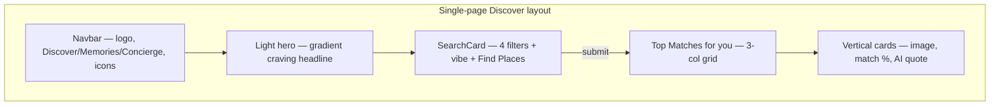

| Section | Component | Description |
|---------|-----------|-------------|
| **Navbar** | `layout/Navbar.tsx` | Red logo tile, “Zomato AI” serif title, Discover (active underline), Memories, Concierge; bell, cart, avatar |
| **Hero** | `layout/HeroSection.tsx` | Light `#F9F9F9` background; “What are you **craving** today?” with purple gradient; neural-engine subtitle |
| **Search card** | `SearchCard.tsx` | White elevated card: Location / Budget / Cuisine / Min Rating row; “Describe your vibe” + **Find Places** |
| **Results header** | `App.tsx` | “Top Matches for you” + filter/grid icon buttons |
| **Results** | `RecommendationCard.tsx` | Food image, match % badge, category tag, green rating, italic AI quote |
| **Summary** | `SummaryBanner.tsx` | LLM summary + meta pills above the grid |

### 10.4 SearchCard Fields

| Field | UI Control | Maps to API |
|-------|------------|-------------|
| Location | Area dropdown with pin icon | `area` (or all Bangalore) |
| Budget for two | Editable numeric text input (₹) — can be cleared and retyped; validated on blur/submit (₹100–₹10,000) | `max_budget` — maximum spend **for two people** |
| Cuisine | Dropdown from meta API | `cuisine` |
| Min Rating | Dropdown (Any, 3.0+, … 4.5+) | `min_rating` |
| Describe your vibe | Textarea | `additional_preferences` |
| Submit | **Find Places** button | `POST /api/v1/recommendations` |

Nav links (Memories, Concierge), filter/grid toggles, bell, cart, and avatar are **UI placeholders** for future features.

**Budget empty state:** When the filter finds restaurants for the chosen cuisine/area/rating but **none** at the user's `max_budget`, the API sets `meta.budget_blocked: true`. If the final recommendation list is empty, the UI shows **`have nothing in this budget !`** in red instead of the generic empty message.

### 10.5 RecommendationCard

```
┌──────────────────────────────────────────────┐
│  [food photo]              98% Match ▓▓▓▓  │
│              PREMIUM SELECTION               │
├──────────────────────────────────────────────┤
│  The Spice Route                    4.9 ★   │
│  Pan-Asian • Mayfair • ₹600 for two         │
│  ┌────────────────────────────────────────┐│
│  │ "Matches your love for vibrant, spicy…" ││
│  └────────────────────────────────────────┘│
└──────────────────────────────────────────────┘
```

- **Match %** derived from rank + rating (`utils/cardMeta.ts`) — display-only until backend adds scores.
- **Category tags** (PREMIUM SELECTION, etc.) derived from `price_range` and rank.
- Food images from Unsplash placeholders (dataset has no image URLs).
- Results sorted **rating descending** (backend + frontend).

### 10.6 States

| State | UI Behavior |
|-------|-------------|
| **Idle** | Faded placeholder cards + hint to use Find Places |
| **Loading** | Spinner + 3 skeleton cards |
| **Success** | Summary banner + 3-column recommendation grid |
| **Empty (budget)** | Red text: `have nothing in this budget !` when `meta.budget_blocked` and zero recommendations |
| **Empty (other)** | Generic message to broaden filters |
| **Error** | Red alert with retry + optional request ID |

### 10.7 Frontend ↔ Backend Integration

Implemented in `frontend/src/api/recommendations.ts`:

```typescript
const API_BASE = import.meta.env.VITE_API_URL ?? "";  // empty = Vite proxy

export async function fetchCities(): Promise<string[]>
export async function fetchAreas(city?: string): Promise<string[]>
export async function fetchCuisines(city?: string): Promise<string[]>
export async function getRecommendations(req: RecommendationRequest): Promise<RecommendationResponse>
export async function fetchHealth(): Promise<{ status: string; restaurant_count: number; llm_available: boolean }>
```

Types live in `frontend/src/types/index.ts`. Component map:

| Component | File | Purpose |
|-----------|------|---------|
| `App` | `App.tsx` | Discover page shell, state machine |
| `SearchCard` | `components/SearchCard.tsx` | Filter row + vibe textarea + Find Places |
| `RecommendationCard` | `components/RecommendationCard.tsx` | Match card with image, badge, AI quote |
| `SummaryBanner` | `components/SummaryBanner.tsx` | LLM summary + meta pills |
| `LoadingState` | `components/LoadingState.tsx` | Spinner + skeleton cards |
| `Navbar` | `components/layout/Navbar.tsx` | Discover navigation |
| `HeroSection` | `components/layout/HeroSection.tsx` | Craving headline + search card wrapper |
| `cardMeta` | `utils/cardMeta.ts` | Match %, category tags, food image URLs |

Styling: `tailwind.config.js` (primary `#CB202D`, rating green `#24963F`), `src/index.css`.

### 10.8 Phase 5 Deliverables & Exit Criteria

| Deliverable | Exit Criterion | Actual |
|-------------|----------------|--------|
| Discover layout | Matches v1.3 mockup structure | Done |
| Preference form | All filters + vibe textarea functional | Done |
| API integration | Successful POST and error handling | Done |
| Match cards | Image, match %, tag, rating, AI quote | Done |
| Responsive layout | Mobile and desktop | Done |
| Loading / error states | All paths covered | Done |

### 10.9 Future Frontend Enhancements

| Enhancement | Notes |
|-------------|-------|
| Real match scores | Backend-computed relevance instead of rank-derived % |
| Restaurant photos from dataset | Replace Unsplash placeholders |
| Memories / Concierge pages | Wire nav links |
| Filter & list/grid toggles | Functional view modes |
| Compare feature | Side-by-side card comparison |

---

## 11. Phase 6 — Hardening & Production

### 11.1 Objective

Make the system reliable, observable, secure, and deployable.

**Production deployment target:** see [§18 Deployment Architecture](#18-deployment-architecture) — **Vercel** (frontend) + **Streamlit Community Cloud** (backend).

### 11.2 Caching Layer

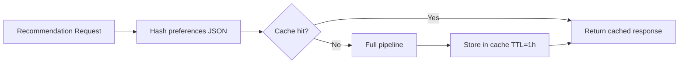

- Cache key: `SHA-256(normalized_preferences_json)`
- Backend: in-memory (dev) or Redis (prod).
- Invalidate on dataset re-ingestion.

### 11.3 Observability

| Signal | Implementation |
|--------|----------------|
| **Structured logging** | `structlog` or Python `logging` with JSON formatter |
| **Request tracing** | `X-Request-ID` propagated through all layers |
| **Metrics** | Filter candidate count, LLM latency, cache hit rate |
| **Health check** | `/health` returns DB connectivity + LLM reachability |

### 11.4 Configuration Management

```env
# .env.example
DATABASE_URL=sqlite:///./data/processed/restaurants.db

# Groq LLM (Phase 3) — copy to .env and set your key
GROQ_API_KEY=gsk_your_key_here
LLM_PROVIDER=groq
LLM_MODEL=llama-3.3-70b-versatile
LLM_ENABLED=true
LLM_TIMEOUT_SECONDS=30

MAX_CANDIDATES=30
CACHE_TTL_SECONDS=3600
CORS_ORIGINS=http://localhost:5173
LOG_LEVEL=INFO
```

### 11.5 Phase 6 Deliverables & Exit Criteria

| Deliverable | Exit Criterion |
|-------------|----------------|
| Docker setup | `docker-compose up` runs full stack (optional; §18.6) |
| Vercel + Streamlit deploy | Frontend live on Vercel; backend live on Streamlit Cloud |
| `.env.example` | Documented, no secrets |
| Rate limiting | 10 req/min per IP on `/recommendations` |
| Test suite | ≥ 80% coverage on filter + validation logic |
| CI pipeline | Lint + test on push |

---

## 12. Data Models

### 12.1 Restaurant (Database Entity)

```python
class Restaurant(Base):
    __tablename__ = "restaurants"

    id: Mapped[int] = mapped_column(primary_key=True)
    name: Mapped[str]
    city: Mapped[str]
    area: Mapped[str | None]
    address: Mapped[str | None]
    cuisines: Mapped[str]          # JSON serialized list
    cost_for_two: Mapped[int | None]
    price_range: Mapped[str]     # low | medium | high
    rating: Mapped[float | None]
    votes: Mapped[int]
    restaurant_type: Mapped[str | None]
    online_order: Mapped[bool]
    book_table: Mapped[bool]
    popular_dishes: Mapped[str | None]  # JSON serialized list
```

### 12.2 API Response Models

```python
class RecommendationItem(BaseModel):
    rank: int
    restaurant_id: int
    name: str
    cuisines: list[str]
    rating: float | None
    cost_for_two: int | None
    price_range: str
    explanation: str

class RecommendationMeta(BaseModel):
    total_candidates: int
    filters_relaxed: bool
    llm_used: bool
    processing_time_ms: int
    relaxation_steps: list[str] = []
    budget_blocked: bool = False  # True when matches exist without budget cap but none within max_budget

class RecommendationResponse(BaseModel):
    summary: str
    recommendations: list[RecommendationItem]
    meta: RecommendationMeta
```

---

## 13. API Specification

### 13.1 POST `/api/v1/recommendations`

**Request:**

```json
{
  "location": "Bangalore",
  "budget": "medium",
  "cuisine": "Italian",
  "min_rating": 4.0,
  "additional_preferences": "family friendly, quick service"
}
```

**Response (200):**

```json
{
  "summary": "Here are five Italian restaurants in Bangalore that match your medium budget and rating requirements.",
  "recommendations": [
    {
      "rank": 1,
      "restaurant_id": 1042,
      "name": "Truffles",
      "cuisines": ["Italian", "American"],
      "rating": 4.6,
      "cost_for_two": 900,
      "price_range": "high",
      "explanation": "A highly-rated spot known for Italian-American comfort food, popular with families."
    }
  ],
  "meta": {
    "total_candidates": 18,
    "filters_relaxed": false,
    "llm_used": true,
    "processing_time_ms": 2340
  }
}
```

**Error Responses:**

| Status | Condition | Body |
|--------|-----------|------|
| 422 | Validation failure | `{ "detail": [{ "loc": ["budget"], "msg": "..." }] }` |
| 404 | City not in dataset | `{ "detail": "City 'X' not found. See /meta/cities." }` |
| 503 | LLM unavailable (no fallback) | `{ "detail": "Recommendation service temporarily unavailable." }` |
| 500 | Unexpected error | `{ "detail": "Internal server error.", "request_id": "..." }` |

### 13.2 GET `/api/v1/meta/cities`

**Response (200):**

```json
{
  "cities": ["Bangalore"]
}
```

> Currently one city in the ingested dataset. Multi-city support is ready at the code level.

### 13.4 GET `/api/v1/meta/areas` *(planned — v1.1)*

**Query params:** `?city=Bangalore` (required)

**Response (200):**

```json
{
  "areas": ["All Bangalore", "BTM", "Electronic City", "HSR", "Marathahalli", "Whitefield"]
}
```

See [improvements.md §2.1](./improvements.md#21-meta-endpoint-for-areas-p1).

### 13.3 GET `/api/v1/meta/cuisines`

**Query params:** `?city=Bangalore` (optional)

**Response (200):**

```json
{
  "cuisines": ["Italian", "Chinese", "North Indian", "South Indian", "Mexican"]
}
```

---

## 14. Prompt Engineering Strategy

### 14.1 System Prompt (Template)

```
You are an expert restaurant recommendation assistant for Indian cities.
You receive a user's dining preferences and a list of candidate restaurants (JSON).
Your job is to:

1. Select the top {max_results} restaurants that best match the user's preferences.
2. Rank them from best (rank 1) to fifth best (rank 5).
3. Write a concise, friendly explanation (2–3 sentences) for each restaurant.
4. Write a brief overall summary (1–2 sentences) of the recommendations.

Rules:
- ONLY recommend restaurants from the provided candidate list.
- Use the exact restaurant_id and restaurant_name from the candidates.
- Consider rating, budget fit, cuisine match, and any additional preferences.
- If additional preferences mention "family friendly", favor casual dining / family restaurants.
- If "quick service" is mentioned, favor quick bites / fast food types.
- Be honest: if a restaurant is slightly above budget, mention it.
- Respond ONLY with valid JSON matching the required schema.
```

### 14.2 User Prompt (Template)

```
User Preferences:
- Location: {location}
- Budget: {budget}
- Cuisine: {cuisine}
- Minimum Rating: {min_rating}
- Additional Preferences: {additional}

Candidate Restaurants:
{candidates}

Respond with JSON in this exact format:
{
  "summary": "<overall summary>",
  "recommendations": [
    {
      "rank": <1-5>,
      "restaurant_id": <id from candidates>,
      "restaurant_name": "<name from candidates>",
      "explanation": "<why this restaurant fits>"
    }
  ]
}
```

### 14.3 Token Budget Management

| Component | Estimated Tokens |
|-----------|-----------------|
| System prompt | ~250 |
| User preferences | ~50 |
| 30 candidates × ~80 tokens each | ~2,400 |
| Response (5 recommendations) | ~500 |
| **Total per request** | **~3,200** |

If token limits are exceeded, reduce `MAX_CANDIDATES` or truncate `popular_dishes` in candidate dicts.

---

## 15. Error Handling & Fallbacks

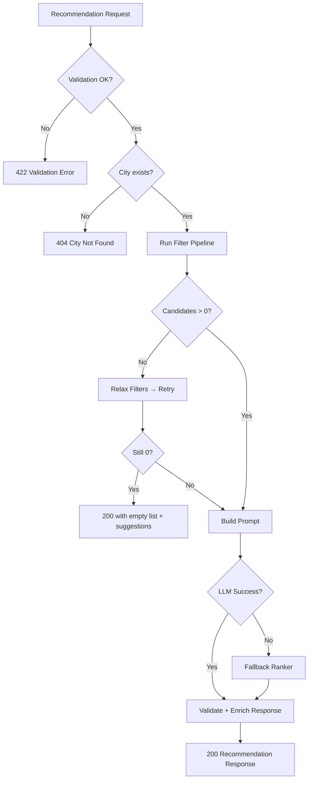

| Failure Mode | User-Facing Behavior | Internal Action |
|--------------|---------------------|-----------------|
| Invalid input | 422 with field errors | Log validation failure |
| Unknown city | 404 with city list link | Log unknown city attempt |
| No matches after relaxation | 200, empty recommendations + message | Suggest broadening criteria |
| LLM timeout | 200, fallback rankings | Log timeout, alert if frequent |
| LLM malformed JSON | Retry once, then fallback | Log raw response for debugging |
| Database error | 500 with request ID | Log stack trace |

---

## 16. Security Considerations

| Risk | Mitigation |
|------|------------|
| API key exposure | Store `GROQ_API_KEY` in `.env`; never commit; use secrets manager in prod |
| Prompt injection via `additional_preferences` | Sanitize input; strip control characters; wrap in delimiters in prompt |
| Rate abuse / LLM cost | Rate limit `/recommendations`; cap `MAX_CANDIDATES` |
| CORS misconfiguration | Whitelist specific origins |
| SQL injection | Parameterized queries via SQLAlchemy ORM |
| Large payload attacks | Pydantic `max_length` on all string fields |

---

## 17. Testing Strategy

### 17.1 Test Pyramid

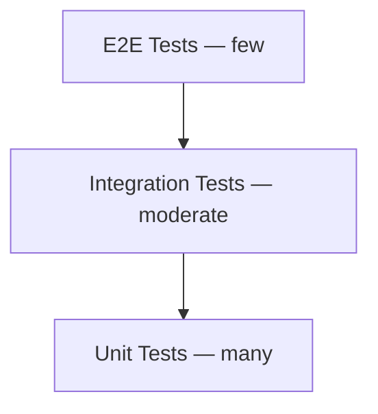

### 17.2 Unit Tests

| Module | Test Cases |
|--------|------------|
| `filter.py` | City filter, cuisine match, rating threshold, budget tier, keyword scoring |
| `prompt.py` | Template rendering, token count within limits |
| `schemas.py` | Valid/invalid preference combinations |
| `ranker.py` | Fallback scoring order, explanation generation |
| `loader.py` | Cost parsing ("500-800" → 650), rating parsing ("4.1/5" → 4.1) |

### 17.3 Integration Tests

| Test | Description |
|------|-------------|
| Full pipeline (mocked LLM) | Preferences → filtered → ranked response |
| API endpoint | POST with valid/invalid bodies |
| Empty shortlist relaxation | Verify broadened results returned |
| LLM failure fallback | `LLM_ENABLED=false` returns rule-based results |

### 17.4 E2E Tests (Phase 5+)

- **Manual (implemented):** Open `http://localhost:5173` → submit form → see 5 recommendation cards with Groq summary.
- Invalid city → error message displayed.
- Loading state appears during API call.
- Automated browser E2E (Playwright/Cypress) — planned for Phase 6.

---

## 18. Deployment Architecture

### 18.1 Development (local)

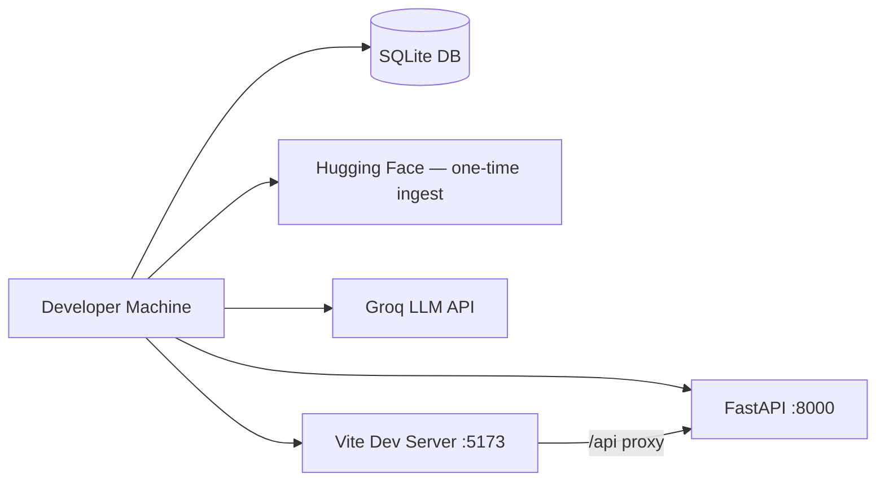

| Component | Command | URL |
|-----------|---------|-----|
| Backend | `uvicorn src.phase2.main:app --reload --port 8000` | http://127.0.0.1:8000 |
| Frontend | `cd frontend && npm run dev` | http://localhost:5173 |
| API docs | — | http://127.0.0.1:8000/docs |

Locally, Vite proxies `/api/*` to the backend (`frontend/vite.config.ts`). No `VITE_API_URL` is required in dev.

---

### 18.2 Production (target)

Production splits the stack across two managed platforms:

| Layer | Platform | Repository path | Role |
|-------|----------|-----------------|------|
| **Frontend** | **Vercel** | `frontend/` | Static React build; calls backend over HTTPS |
| **Backend** | **Streamlit Community Cloud** | `src/` (Python) | Hosts the recommendation API and pipeline |

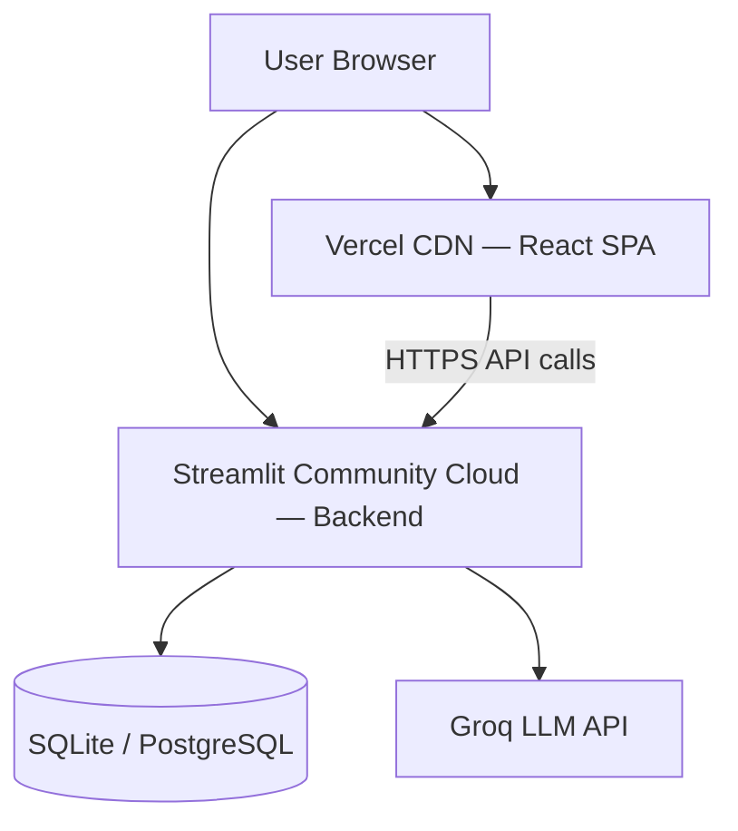

**Request flow in production**

1. User opens the Vercel-hosted SPA (e.g. `https://your-app.vercel.app`).
2. The browser sends `GET`/`POST` requests to the Streamlit-hosted backend base URL (e.g. `https://your-app.streamlit.app/api/v1/...`).
3. The backend filters restaurants from the database, calls Groq when enabled, and returns JSON.
4. The frontend renders recommendation cards.

> **Note:** The codebase backend is **FastAPI** (`src/phase2/main.py` for local dev). **Streamlit Community Cloud** uses `streamlit_app.py` at the repo root, which combines the same FastAPI routes with a Streamlit status dashboard via Streamlit 1.58 ASGI mounting. The API surface in §13 is unchanged.

---

### 18.3 Frontend deployment — Vercel

**Root directory:** `frontend/` (set as the Vercel project root, or deploy from monorepo with root dir override).

| Setting | Value |
|---------|--------|
| Framework preset | Vite |
| Build command | `npm run build` |
| Output directory | `dist` |
| Install command | `npm install` |

**Environment variables (Vercel dashboard)**

| Variable | Example | Purpose |
|----------|---------|---------|
| `VITE_API_URL` | `https://your-backend.streamlit.app` | Base URL of the Streamlit-hosted backend (no trailing slash) |

The frontend client reads this in `frontend/src/api/recommendations.ts`:

```typescript
const API_BASE = import.meta.env.VITE_API_URL ?? "";
// Production: fetch(`${API_BASE}/api/v1/recommendations`, ...)
// Local dev: empty string → Vite proxy to :8000
```

**CORS:** Add the Vercel production URL to `CORS_ORIGINS` in the backend `.env` / Streamlit secrets (e.g. `https://your-app.vercel.app`).

**Deploy steps (summary)**

1. Connect the GitHub repository to Vercel.
2. Set root directory to `frontend/`.
3. Add `VITE_API_URL` pointing at the Streamlit backend URL.
4. Deploy; Vercel serves the static `dist/` bundle on its CDN.

Optional `vercel.json` in `frontend/` for SPA routing (all routes → `index.html`):

```json
{
  "rewrites": [{ "source": "/(.*)", "destination": "/index.html" }]
}
```

---

### 18.4 Backend deployment — Streamlit Community Cloud

**Repository requirements**

| File | Purpose |
|------|---------|
| `requirements.txt` | Python dependencies (FastAPI, uvicorn, groq, SQLAlchemy, etc.) |
| `.streamlit/config.toml` | Streamlit Cloud app settings (optional) |
| `streamlit_app.py` | **Main file** on Streamlit Cloud — FastAPI + mounted Streamlit UI |
| `streamlit_ui.py` | Streamlit status dashboard (DB count, LLM status, API docs) |
| `.streamlit/secrets.toml.example` | Template for Streamlit Cloud secrets |

**Secrets (Streamlit Cloud → App settings → Secrets)**

| Secret | Purpose |
|--------|---------|
| `GROQ_API_KEY` | Groq LLM authentication |
| `LLM_ENABLED` | `true` / `false` |
| `DATABASE_URL` | SQLite path or PostgreSQL connection string |
| `CORS_ORIGINS` | Comma-separated list including Vercel URL |

**Data:** Ship `data/processed/restaurants.db` with the repo (or run `python scripts/ingest.py` in a one-off job and attach persistent storage). For production scale, migrate to PostgreSQL (see Phase 6).

**API endpoints exposed** (same as local — see §13):

| Method | Path |
|--------|------|
| `GET` | `/api/v1/health` |
| `GET` | `/api/v1/meta/cities` |
| `GET` | `/api/v1/meta/areas` |
| `GET` | `/api/v1/meta/cuisines` |
| `POST` | `/api/v1/recommendations` |

**Deploy steps (summary)**

1. Push the repository to GitHub.
2. Create a new app at [share.streamlit.io](https://share.streamlit.io) (Streamlit Community Cloud).
3. Select the repo, set **Main file path** to `streamlit_app.py`, and configure secrets (see `.streamlit/secrets.toml.example`).
4. After deploy, copy the public URL and set it as `VITE_API_URL` on Vercel.
5. Verify: `GET https://<streamlit-app>/api/v1/health` returns `200`.

**Backend source layout**

| Path | Role |
|------|------|
| `streamlit_app.py` | **Streamlit Cloud entry** — `streamlit run streamlit_app.py` |
| `streamlit_ui.py` | Streamlit admin dashboard mounted at `/` |
| `src/phase2/main.py` | Local FastAPI entry (`uvicorn src.phase2.main:app`) |
| `src/phase2/app_factory.py` | Shared FastAPI factory used by both entries |
| `src/deploy/env.py` | Loads Streamlit secrets into `os.environ` before config |
| `src/phase2/api/routes.py` | REST route definitions |
| `src/phase2/services/orchestrator.py` | Recommendation pipeline |
| `src/phase3/llm.py` | Groq client |
| `src/config.py` | Environment configuration |

---

### 18.5 Environment matrix

| Variable | Local | Vercel | Streamlit |
|----------|-------|--------|-----------|
| `VITE_API_URL` | *(unset — uses proxy)* | Backend base URL | — |
| `GROQ_API_KEY` | `.env` | — | Secrets |
| `DATABASE_URL` | `.env` / default SQLite | — | Secrets |
| `CORS_ORIGINS` | `http://localhost:5173` | — | Vercel URL + localhost |
| `LLM_ENABLED` | `.env` | — | Secrets |

---

### 18.6 Docker Compose (optional — Phase 6)

Local or self-hosted alternative; not used for the Vercel + Streamlit production target.

```yaml
# Conceptual — docker-compose.yml (Phase 6)
services:
  backend:
    build: .
    command: uvicorn src.phase2.main:app --host 0.0.0.0 --port 8000
    ports: ["8000:8000"]
    env_file: .env
    volumes: ["./data:/app/data"]

  frontend:
    build: ./frontend
    ports: ["5173:80"]
    depends_on: [backend]
```

---

## 19. Project Structure

```
restaurant-recommendation-app/
├── src/
│   ├── config.py                   # DB, CORS, Groq/LLM, MAX_CANDIDATES, MAX_RECOMMENDATIONS
│   ├── phase1/                     # Data ingestion & storage
│   │   ├── constants.py
│   │   ├── schema.py               # SQLAlchemy ORM
│   │   ├── database.py
│   │   ├── preprocessor.py
│   │   ├── loader.py               # RestaurantRepository
│   │   └── ingest.py
│   ├── phase2/                     # API layer
│   │   ├── main.py                 # FastAPI entry: uvicorn src.phase2.main:app
│   │   ├── api/
│   │   │   ├── routes.py
│   │   │   ├── schemas.py
│   │   │   ├── normalizer.py
│   │   │   └── dependencies.py
│   │   ├── middleware/
│   │   │   └── request_id.py
│   │   └── services/
│   │       └── orchestrator.py
│   ├── phase3/                     # Filter + Groq integration
│   │   ├── filter.py
│   │   ├── prompt.py
│   │   └── llm.py
│   ├── phase4/                     # Recommendation engine
│   │   ├── engine.py
│   │   └── ranker.py
│   ├── phase5/                     # Frontend (code lives in frontend/)
│   │   └── __init__.py
│   └── phase6/                     # Hardening (placeholder)
│       └── __init__.py
├── design/
│   └── zomato-ai-home-mockup.png   # UI design reference (Zomato AI)
├── frontend/
│   ├── src/
│   │   ├── App.tsx
│   │   ├── index.css               # Tailwind entry + field utilities
│   │   ├── main.tsx
│   │   ├── api/
│   │   │   └── recommendations.ts
│   │   ├── components/
│   │   │   ├── SearchCard.tsx      # Filter row + vibe + Find Places
│   │   │   ├── RecommendationCard.tsx
│   │   │   ├── SummaryBanner.tsx
│   │   │   ├── LoadingState.tsx
│   │   │   └── layout/
│   │   │       ├── Navbar.tsx
│   │   │       └── HeroSection.tsx
│   │   ├── utils/
│   │   │   └── cardMeta.ts         # Match %, tags, food images
│   │   └── types/
│   │       └── index.ts
│   ├── index.html
│   ├── tailwind.config.js
│   ├── postcss.config.js
│   ├── vite.config.ts              # port 5173, /api proxy → :8000
│   └── package.json
├── scripts/
│   ├── ingest.py                   # CLI → src.phase1.ingest
│   ├── verify_llm_flow.py          # Live Groq smoke tests
│   └── verify_phase4.py            # Live Phase 4 smoke tests
├── tests/                          # pytest (81 tests)
├── data/
│   └── processed/
│       └── restaurants.db          # Generated — gitignored
├── docs/
│   ├── problemStatement
│   ├── architecture.md             # This document
│   └── improvements.md             # Planned frontend/backend/logic changes
├── requirements.txt
├── pytest.ini
├── .env.example
└── .gitignore
```

### Key Commands

| Task | Command |
|------|---------|
| Ingest dataset | `python scripts/ingest.py` |
| Run API | `uvicorn src.phase2.main:app --reload --port 8000` |
| Run UI (local) | `cd frontend && npm run dev` |
| Deploy frontend | Vercel — root `frontend/`, set `VITE_API_URL` (see §18.3) |
| Deploy backend | Streamlit Community Cloud — main file `streamlit_app.py`, secrets (see §18.4) |
| Unit tests | `python -m pytest tests` |
| Live LLM check | `python scripts/verify_llm_flow.py` |

---

## 20. Phase Dependencies & Timeline

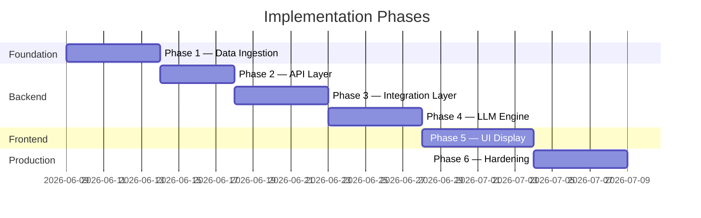

### Dependency Graph

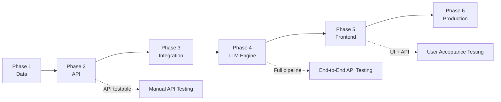

### Recommended Build Order

1. **Phase 1** — Unblocks everything; no external API keys needed.
2. **Phase 2** — Enables manual API testing with curl/Postman.
3. **Phase 3** — Validate filter accuracy before spending on LLM calls.
4. **Phase 4** — Wire LLM; test with `LLM_ENABLED=false` first.
5. **Phase 5** — Frontend once API contract is stable.
6. **Phase 6** — Polish after core flow works.

---

## 21. Future Enhancements

See **[improvements.md](./improvements.md)** for prioritized v1.1 work (numeric budget, Bangalore area filter, fixed LLM candidate count).

| Enhancement | Description | Phase |
|-------------|-------------|-------|
| Bangalore area filter | Area dropdown + `GET /meta/areas` | v1.1 — [improvements.md](./improvements.md) |
| Numeric budget | INR input instead of low/medium/high | v1.1 — [improvements.md](./improvements.md) |
| Fixed LLM candidate count | Constant rows in prompt (not env-tunable) | v1.1 — [improvements.md](./improvements.md) |
| Docker + compose | Single-command dev/prod deploy | Phase 6 |
| Response caching | Redis / in-memory TTL cache | Phase 6 |
| User accounts | Save preferences and history | Post-v1 |
| Feedback loop | "Was this helpful?" thumbs up/down | Post-v1 |
| Map view | Show restaurant locations on a map | Post-v1 |
| Multi-cuisine search | Select multiple cuisines | Post-v1 |
| Streaming LLM response | Stream summary text for perceived speed | Post-v1 |
| Admin dashboard | Dataset stats, ingestion monitoring | Post-v1 |
| A/B prompt testing | Compare prompt variants for quality | Post-v1 |
| Vector search | Semantic matching on dish descriptions | v2 |
| Custom fine-tuned ranker | Reduce LLM dependency and cost | v2 |

---

## 22. Implementation Status

### 22.1 Pipeline Overview (as built)

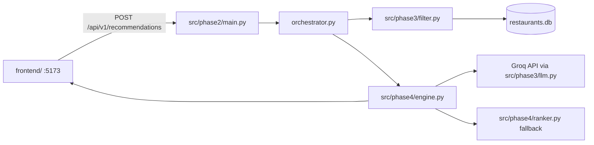

### 22.2 Configuration (`.env`)

| Variable | Default | Purpose |
|----------|---------|---------|
| `DATABASE_URL` | SQLite path | Database connection |
| `GROQ_API_KEY` | — | Groq API authentication |
| `LLM_MODEL` | `llama-3.3-70b-versatile` | Groq model ID |
| `LLM_ENABLED` | `true` | Set `false` for fallback-only |
| `MAX_CANDIDATES` | `30` | Max restaurants in LLM prompt |
| `MAX_RECOMMENDATIONS` | `5` | Max results in API response |
| `CORS_ORIGINS` | `http://localhost:5173` | Allowed frontend origins |

### 22.3 Test Coverage

| Suite | Count | Notes |
|-------|-------|-------|
| `python -m pytest tests` | 81 passing | LLM disabled in test fixture |
| `scripts/verify_llm_flow.py` | 4 scenarios | Live Groq |
| `scripts/verify_phase4.py` | 3 scenarios | Live end-to-end engine |

### 22.4 Known Gaps (v1)

| Gap | Detail | Tracked in |
|-----|--------|------------|
| Single city | Dataset is Bangalore-only | improvements.md §3.4 |
| Restaurant photos | Cards use gradient placeholders | architecture §10.9 |
| Voice input | Microphone icon is UI-only | architecture §10.9 |
| Phase 6 | No Docker, cache, or rate limits yet | architecture §11 |

---

## Appendix A: Glossary

| Term | Definition |
|------|------------|
| **Shortlist** | Filtered set of candidate restaurants sent to Groq (currently capped at `MAX_CANDIDATES`, default 30) |
| **Budget tier** | Categorical price band: low, medium, high — **planned replacement:** numeric `max_budget` (INR) |
| **Area** | Bangalore neighborhood stored in `restaurants.area` — not yet used in v1 filters |
| **Relaxation** | Progressively broadening filters when no candidates match |
| **Enrichment** | Merging LLM output with full database metadata for the response |
| **Fallback ranker** | Rule-based ranking used when the LLM is unavailable |

## Appendix B: Key Design Decisions

| Decision | Choice | Alternatives Considered | Rationale |
|----------|--------|------------------------|-----------|
| Filter before LLM | Yes — deterministic pre-filter | Send full dataset to LLM | Cost, latency, accuracy |
| Database | SQLite (MVP) → PostgreSQL | CSV in memory | Query flexibility, indexing |
| LLM role | Rank + explain only | LLM does filtering too | Structured filters are more reliable |
| Structured output | JSON mode | Free-text parsing | Fewer parsing failures |
| Frontend framework | React + Vite | Next.js, Vue, Svelte | SPA fits API-driven flow; Next.js optional for SSR later |
| CSS approach | Tailwind CSS 3 | CSS modules, styled-components | Rapid Zomato-themed layout from mockup |
| LLM provider | **Groq** | OpenAI, Anthropic | Fast inference, cost-effective; API key via `.env` |

---

*This document reflects the implemented `src/` + `frontend/` layout (v1.4). Update alongside [improvements.md](./improvements.md) as changes land.*
