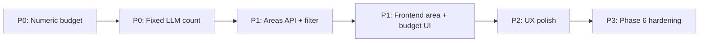

# Planned Improvements

> **Scope:** Frontend, backend/API, and business logic refinements identified after the v1 end-to-end implementation (Phases 1–5).  
> **Related:** [architecture.md](./architecture.md) · [problemStatement](./problemStatement)  
> **Status:** P0–P2 items below were **implemented** (June 2026). Phase 6 (P3) remains planned.

This document captures **what should change next** and **why**. Items are grouped by layer. Priority labels are suggestions for sequencing work.

---

## Summary


| Priority | Area           | Improvement                                                      | Status   |
| -------- | -------------- | ---------------------------------------------------------------- | -------- |
| **P0**   | Business logic | Replace budget tiers with numeric INR input                      | **Done** |
| **P0**   | Business logic | Use a fixed LLM candidate count (remove tunable shortlist size)  | **Done** |
| **P1**   | Frontend + API | Bangalore **area** dropdown instead of city-only location        | **Done** |
| **P1**   | Backend        | Add `GET /api/v1/meta/areas?city=` endpoint                      | **Done** |
| **P2**   | Frontend       | Cuisine dropdown from database meta API                          | **Done** |
| **P2**   | All            | Always return top 5 recommendations when enough candidates exist | **Done** |
| **P2**   | Backend        | Filter pipeline supports `area` dimension                        | **Done** |
| **P3**   | All            | Phase 6 hardening (cache, rate limits, Docker)                   | Planned  |


---

## 1. Frontend

### 1.1 Location: Bangalore area dropdown (P1)

**Current behavior**

- `PreferenceForm` loads cities from `GET /api/v1/meta/cities` and shows a single **City** `<select>`.
- The dataset contains only **Bangalore** (~12,494 restaurants), so the city dropdown is effectively a no-op.
- Neighborhood data already exists in the DB: the `area` column is populated for **12,485 / 12,494** rows (e.g. Whitefield, HSR, BTM, Electronic City, Marathahalli).

**Desired behavior**

- Replace (or supplement) the city control with an **area dropdown** listing Bangalore neighborhoods.
- Label clearly: e.g. **“Area in Bangalore”** with an optional **“All Bangalore”** default.
- Populate from a new meta endpoint (see §2.1).

**Files to touch**

- `frontend/src/components/PreferenceForm.tsx`
- `frontend/src/api/recommendations.ts` — add `fetchAreas(city)`
- `frontend/src/types/index.ts` — add `area?: string` to request/form types

---

### 1.2 Budget: numeric input instead of tier radio buttons (P0)

**Current behavior**

- UI exposes **Low / Medium / High** radio buttons mapped to `budget: "low" | "medium" | "high"`.

**Desired behavior**

- Replace with a **numeric input** (INR, “cost for two”) — e.g. number field with min/max validation and optional slider.
- Show helper text: *“Maximum you'd like to spend for two people.”*
- Send `max_budget: number` (or similar) in the API request instead of `budget` enum.

**Files to touch**

- `frontend/src/components/PreferenceForm.tsx`
- `frontend/src/types/index.ts`
- `frontend/src/api/recommendations.ts`

---

### 1.3 Results UX (P2)


| Item                 | Detail                                                                               | Status   |
| -------------------- | ------------------------------------------------------------------------------------ | -------- |
| Show area on cards   | Display `area` under restaurant name when filtering by neighborhood                  | **Done** |
| Filters-relaxed copy | Surface `meta.filters_relaxed` with human-readable text (which filters were relaxed) | **Done** |
| Request ID in errors | Show `request_id` from error responses for debugging                                 | **Done** |


### 1.4 Cuisine dropdown from database (P2)

**Problem (June 2026)**

- Cuisine used a text `<input>` + `<datalist>`, which only suggests options while typing.
- On load, the form auto-selected the **first alphabetical** cuisine (`Afghan` / `Afghani`), so it looked like only one cuisine existed.
- The backend already exposes **108** cuisines via `GET /api/v1/meta/cuisines?city=Bangalore`.

**Fix**

- Replace with a native `<select>` populated from `fetchCuisines(city)`.
- Show helper text with the loaded count (e.g. “108 cuisines in Bangalore”).
- Use a “Select cuisine…” placeholder; do not default to the first alphabetical entry.

**Files**

- `frontend/src/components/PreferenceForm.tsx`
- `frontend/src/App.css` (select styling)

### 1.5 Always show top 5 recommendations (P2)

**Problem (June 2026)**

- UI often showed **only 1** recommendation card.
- Causes:
  1. **Filter early exit** — a single strict match returned immediately without gathering more candidates.
  2. **Groq** sometimes returned one item; the prompt example showed only one JSON object.
  3. **Validation** did not coerce string `restaurant_id` values from Groq.

**Fix**

- Filter merges strict + relaxed candidates until at least **5** are available (up to `LLM_CANDIDATE_COUNT`).
- Prompt requires **exactly 5** recommendations when enough candidates exist; candidates use `restaurant_id` field.
- Engine `**ensure_recommendation_count`** supplements LLM output with fallback ranker to reach 5.
- UI results heading: **“Top 5 recommendations”**.
- Results sorted by **rating descending** (highest rated shown first).

**Files**

- `src/phase3/filter.py`, `src/phase3/prompt.py`, `src/phase4/engine.py`
- `frontend/src/App.tsx`
- `src/config.py` — `LLM_MAX_TOKENS` default raised to 2500

---

## 2. Backend & API

### 2.1 Meta endpoint for areas (P1)

**Current behavior**

- `GET /api/v1/meta/cities` → `["Bangalore"]`
- `GET /api/v1/meta/cuisines?city=Bangalore` → cuisine list
- No areas endpoint; `RestaurantRepository` has no `get_areas()`.

**Desired behavior**

```
GET /api/v1/meta/areas?city=Bangalore
→ { "areas": ["All Bangalore", "BTM", "Electronic City", "HSR", ...] }
```

- Sort by restaurant count (desc) or alphabetically.
- Optionally include counts: `{ "name": "HSR", "count": 705 }`.

**Files to touch**

- `src/phase1/loader.py` — `get_areas(city: str) -> list[str]`
- `src/phase2/api/schemas.py` — `AreasResponse`
- `src/phase2/api/routes.py` — route handler

---

### 2.2 Budget field: numeric API contract (P0)

**Current behavior**

```python
class RecommendationRequest(BaseModel):
    budget: BudgetTier  # "low" | "medium" | "high"
```

Filtering uses `price_range` enum on the restaurant row, derived at ingestion from `cost_for_two` percentiles.

**Desired behavior**

```python
class RecommendationRequest(BaseModel):
    max_budget: int = Field(..., ge=100, le=10000)  # INR for two
```

- Filter with `cost_for_two <= max_budget` (with NULL handling).
- Relaxation: increase budget by 10–20% per step instead of adjacent tier.
- Remove `BudgetTier` from public API (keep internal tier only if needed for fallback messaging).

**Files to touch**

- `src/phase2/api/schemas.py`
- `src/phase2/api/normalizer.py`
- `src/phase3/filter.py` — replace `price_range` filter with cost filter
- `src/phase3/prompt.py` — pass `₹{max_budget} for two` instead of tier label
- `tests/` — update schema, filter, and API tests

---

### 2.3 Location model: city + area (P1)

**Current behavior**

- `location` in the request maps to `city` in DB queries.
- `area` column exists but is never used in filtering.

**Desired behavior**

- Accept `location: "Bangalore"` (fixed or implicit) and optional `area: string`.
- When `area` is set, add `WHERE area = :area` (with alias normalization for variants like “HSR Layout” → “HSR”).
- When `area` is `"All Bangalore"` or omitted, filter city-wide.

**Files to touch**

- `src/phase2/api/schemas.py`, `normalizer.py`
- `src/phase1/loader.py` — extend `get_by_filters(area=...)`
- `src/phase3/filter.py`

---

### 2.4 Other API improvements (P2–P3)


| Item                  | Detail                                                                   |
| --------------------- | ------------------------------------------------------------------------ |
| OpenAPI examples      | Add request/response examples for `/recommendations` in route decorators |
| Health check          | Include `llm_available: bool` in `GET /health`                           |
| Rate limiting         | Phase 6 — throttle `POST /recommendations`                               |
| Static frontend serve | Optional: FastAPI mounts `frontend/dist` for single-port demo            |


---

## 3. Business Logic

### 3.1 Fixed LLM candidate count (P0)

**Current behavior**

- `MAX_CANDIDATES` is configurable via `.env` (default **30**).
- Filter pipeline caps the shortlist at `MAX_CANDIDATES` after keyword ranking.
- Internal query prefetch uses `MAX_CANDIDATES * 3` before cap.
- Prompt sends **all** candidates in the shortlist to Groq (variable count 1–30).

**Problem**

- Variable shortlist size complicates prompt token budgeting and LLM behavior.
- Exposing `MAX_CANDIDATES` as env config adds little value for v1.

**Desired behavior**

- **Fix** the number of restaurants sent to the model (recommend **20** or **25** — pick one constant in code).
- Remove `MAX_CANDIDATES` from `.env` / user-facing config.
- Always send exactly `LLM_CANDIDATE_COUNT` rows to Groq (pad is unnecessary; if fewer match, send what exists).
- Keep `MAX_RECOMMENDATIONS = 5` for **output** count (unchanged).

**Suggested constants (`src/config.py`)**

```python
LLM_CANDIDATE_COUNT = 20   # fixed rows in prompt — not env-configurable
MAX_RECOMMENDATIONS = 5    # fixed rows in response
```

**Files to touch**

- `src/config.py` — replace `MAX_CANDIDATES` with `LLM_CANDIDATE_COUNT`
- `src/phase3/filter.py` — cap at fixed constant
- `src/phase3/prompt.py` — document fixed count in comments
- `.env.example`, `docs/architecture.md`
- `tests/test_filter.py`

---

### 3.2 Numeric budget filtering & prompt (P0)

**Current behavior**

- Ingestion classifies `price_range` (`low` / `medium` / `high`) from `cost_for_two`.
- Filter step 4: `price_range = :budget`.
- Prompt line: `Budget: medium`.
- Relaxation expands to adjacent tiers (low↔medium↔high).

**Desired behavior**

- Filter step 4: `cost_for_two <= max_budget` (NULL rows excluded or ranked lower).
- Prompt line: `Maximum budget: ₹800 for two`.
- Relaxation: bump `max_budget` by fixed increment (e.g. +₹200) up to 2 steps.
- Fallback ranker (`src/phase4/ranker.py`): score penalty when `cost_for_two > max_budget`.
- LLM rule: *“Prefer restaurants at or below the budget; mention if slightly over.”*

**Files to touch**

- `src/phase3/filter.py`, `prompt.py`
- `src/phase4/ranker.py`, `engine.py` (summary text)
- `src/phase1/preprocessor.py` — keep `price_range` for display only, or derive on read

---

### 3.3 Area-aware filtering (P1)

**Current behavior**

- Five-step filter: city → cuisine → rating → budget tier → keywords.
- `area` stored but unused.

**Desired behavior**

- Insert **area filter** after city (step 1b) when user selects a neighborhood.
- Keyword scoring unchanged; area match is a hard filter, not a score.

---

### 3.4 Dataset & ingestion (P2)


| Item                       | Detail                                                                                                                               |
| -------------------------- | ------------------------------------------------------------------------------------------------------------------------------------ |
| Multi-city data            | Current HF dataset yields **Bangalore only**; ingestion exit criterion “5 cities” not met — source additional data or document scope |
| Area normalization         | Map aliases (`"HSR Layout"` → `"HSR"`, `"Indiranagar"` variants) during ingest                                                       |
| Per-city budget thresholds | Already supported in preprocessor; relevant once numeric budget ships                                                                |


---

### 3.5 Recommendation engine (P2)


| Item                    | Detail                                                                                      |
| ----------------------- | ------------------------------------------------------------------------------------------- |
| Relaxation transparency | Return `meta.relaxation_steps: string[]` (already computed in filter) to UI                 |
| Groq retry/backoff      | Implemented; add metrics/logging in Phase 6                                                 |
| Supplement logic        | Engine supplements to `MIN_LLM_RECOMMENDATIONS` (3) via fallback — document in architecture |


---

## 4. Cross-Cutting

### 4.1 Configuration cleanup


| Keep in `.env`                   | Remove or hardcode                                     |
| -------------------------------- | ------------------------------------------------------ |
| `GROQ_API_KEY`, `LLM_`*          | `MAX_CANDIDATES` → fixed `LLM_CANDIDATE_COUNT` in code |
| `DATABASE_URL`, `CORS_ORIGINS`   |                                                        |
| `MAX_RECOMMENDATIONS` (optional) |                                                        |


### 4.2 Testing updates

After implementing P0–P1 items:

- Update `tests/test_schemas.py` for `max_budget` validation
- Update `tests/test_filter.py` for cost and area filters
- Add `tests/test_meta_areas.py` for new endpoint
- Extend `scripts/verify_llm_flow.py` with numeric budget + area scenarios
- Manual E2E: form → API → Groq → cards

### 4.3 Documentation sync

When each improvement lands, update:

- [architecture.md](./architecture.md) — API spec, filter pipeline, Phase 5 form fields
- [.env.example](../.env.example) — config vars
- This file — mark items **Done** with date

---

## 5. Implementation Order (Recommended)




1. **Numeric budget** — API + filter + prompt (backend-first, keep UI on tiers until API stable).
2. **Fixed LLM candidate count** — small config/filter change, update docs.
3. **Area meta + filter** — backend endpoint and query support.
4. **Frontend** — wire area dropdown and budget input.
5. **Polish** — searchable selects, card area, relaxation messaging.
6. **Phase 6** — Docker, cache, rate limits.

---

## Appendix: Current vs Target (Quick Reference)


| Concern         | Was (v1)                                        | Now (v1.1)                                |
| --------------- | ----------------------------------------------- | ----------------------------------------- |
| Location UI     | City dropdown (`Bangalore` only)                | Bangalore **area** dropdown               |
| Location API    | `location: string` → city                       | `location` + optional `area`              |
| Budget UI       | Low / Medium / High                             | Numeric INR (cost for two)                |
| Budget API      | `budget: enum`                                  | `max_budget: int`                         |
| Budget filter   | `price_range = tier`                            | `cost_for_two <= max_budget`              |
| LLM input size  | Up to 30 (env `MAX_CANDIDATES`)                 | Fixed **20** (`LLM_CANDIDATE_COUNT`)      |
| LLM output size | 5 (`MAX_RECOMMENDATIONS`)                       | 5 (unchanged)                             |
| Cuisine UI      | Text input + datalist (looked like one cuisine) | `**<select>`** with all DB cuisines       |
| Result count    | Often 1 card shown                              | **Top 5** when ≥5 candidates exist        |
| Areas endpoint  | None                                            | `GET /meta/areas?city=`                   |
| Health check    | DB count only                                   | Includes `llm_available`                  |
| Meta response   | —                                               | `relaxation_steps` in recommendation meta |


